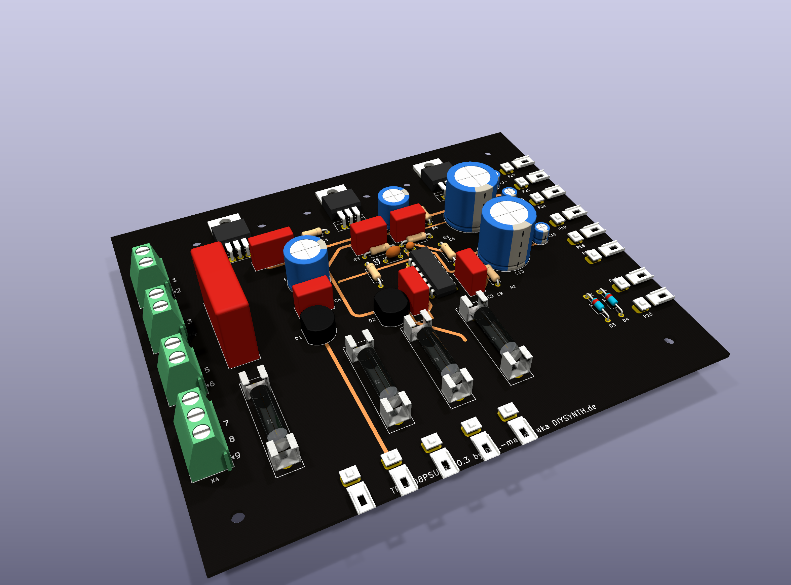
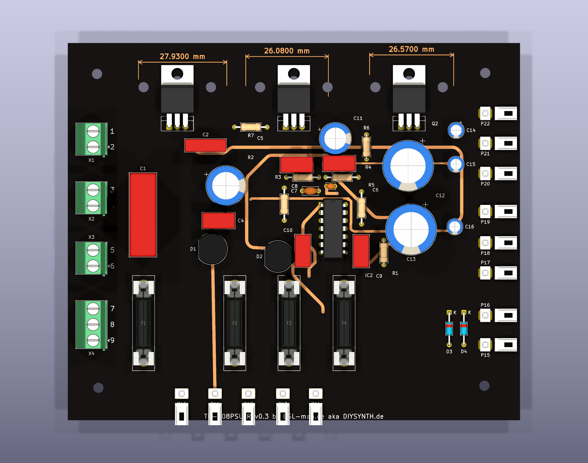
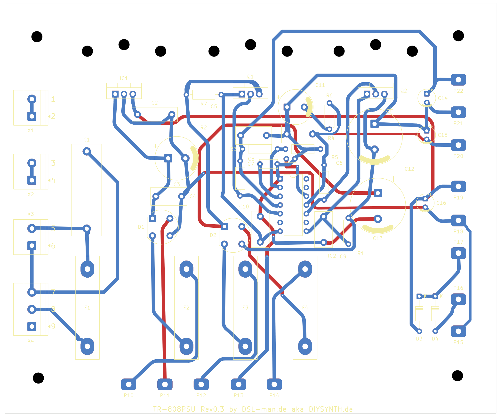
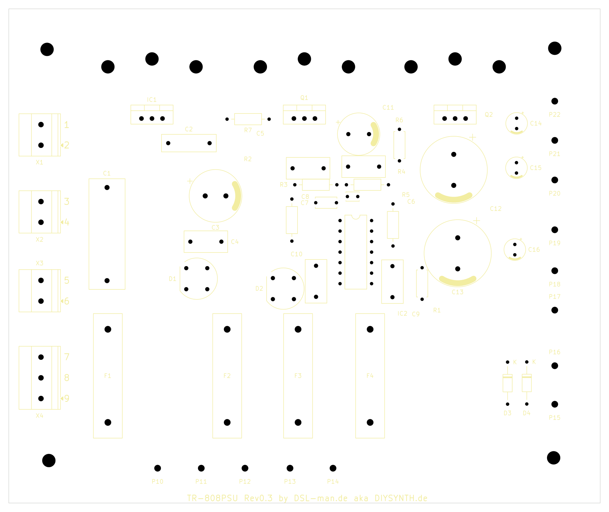

# TR-808PSU

> ## ⚠️ UNTESTED
>
> **This board has not been manufactured, assembled or tested.** It has not been checked
> against the real unit, and it has not been tested against any safety standard. The design
> is a copy of a historical (1984–86) circuit board. It is connected to **mains voltage
> (230 V)**, which can kill. Use at your own risk, and only if you know what you are doing.
> Dimensions are derived from a scan (±3 %), see [VERIFICATION.md](VERIFICATION.md).

KiCad rebuild of the power supply board **PS3116 (PCB 291-405A)** of the Roland TR-808:
schematic redrawn from the 1981 service manual, board with outline, holes, terminals and
component positions taken from the original component layout. **220/240 V** variant
(PS3116-054).

Current version: **Rev0.3**.

| Version | Contents |
|---|---|
| [Rev0.1](https://github.com/dslmande/TR-808PSU/releases/tag/Rev0.1) | historical 1:1 copy of the 1984–86 original; switched mains conductors SW_A/SW_B 3.75 mm apart |
| [Rev0.2](https://github.com/dslmande/TR-808PSU/releases/tag/Rev0.2) | as Rev0.1, but SW_B moved away on the mains side: SW_A/SW_B at least 5.67 mm apart |
| **Rev0.3** (current) | as Rev0.2, but the 230 V primary side (terminals 1–9: mains, switch, transformer input) uses **RM5.0 screw terminals** (Phoenix MKDS 1,5) instead of solder lugs; terminals 10–22 (low voltage) stay solder lugs |

## Pictures









More: [schematic (PDF)](psu/TR-808PSU_Rev0.3_schaltplan.pdf) · [bill of materials](BOM.md) ([CSV](psu/TR-808PSU_Rev0.3_bom.csv)) · [1:1 printout (A4)](psu/TR-808PSU_Rev0.3_ausdruck_1zu1.pdf) · [Gerber (zip)](psu/TR-808PSU_Rev0.3_gerber.zip) · [assembly drawing (PDF)](psu/TR-808PSU_Rev0.3_assembly.pdf) · [original copper vs. tracks](psu/TR-808PSU_Rev0.3_ueberlagerung.png) · [verification](VERIFICATION.md) · [releases](https://github.com/dslmande/TR-808PSU/releases)

## Files

| File | Contents |
|---|---|
| [ORIGINAL.md](ORIGINAL.md) | source, manual pages, variants, circuit description, open points |
| [VERIFICATION.md](VERIFICATION.md) | standards context (DIN EN IEC 62368-1, IEC 60664-1), verification, validation, findings, risks |
| [BOM.md](BOM.md), `psu/TR-808PSU_Rev0.3_bom.csv` | bill of materials (readable, with function and original parts; CSV) |
| `psu/TR-808PSU_Rev0.3.kicad_pro` / `.kicad_sch` / `.kicad_pcb` | KiCad project |
| `psu/TR-808PSU_Rev0.3_schaltplan.pdf` | schematic plot |
| `psu/gerber/`, `psu/TR-808PSU_Rev0.3_gerber.zip` | Gerber, drill data, position file |
| `psu/TR-808PSU_Rev0.3_ausdruck_1zu1.pdf` | 1:1 printout on A4 landscape: component side, solder side, drill template (print at 100 %, check the measuring bar) |
| `psu/TR-808PSU_Rev0.3_3d_oben.png`, `_3d_schraeg.png` | 3D views (KiCad ray tracing; own models for fuse holders and terminal lugs) |
| `psu/TR-808PSU_Rev0.3_pcb_top.pdf`, `_pcb_bottom.pdf`, `_assembly.pdf` | board plots |
| `psu/placement.json`, `psu/placement_scan.json` | component positions from the component layout, resp. aligned to the scan (mm) |
| `psu/kupfer.npz`, `psu/leitkarte.npz` | copper mask and net regions of the original (from the scan) |
| `psu/TR-808PSU_Rev0.3_ueberlagerung.png` | original copper against the tracks of this board |
| `tools/` | generators and tool chain (derived from the Oakley project); comments in the scripts are mostly German |

File names with `schaltplan`, `ausdruck`, `kupfer` and `leitkarte` are German for schematic, printout, copper and guide map.

## What "1:1" means here

* **Circuit:** designators (C1–C16, R1–R7, D1–D4, F1–F4, Q1, Q2, IC1, IC2), values and
  terminal numbers 1–22 as in the original. The schematic is drawn like the original
  (mains and switch left, transformer, +5 V branch, ±15 V branch).
* **Board:** outline, four mounting holes, six heat sink holes (one pair per regulator,
  21.3 mm apart, centred) and three M3 screw holes for the regulators, RM5 screw terminals
  (terminals 1–9), terminal pins (10–22), fuse clips and all components at the positions of
  the original, fine-tuned to the copper of the scan (`tools/scan/`). The original is single
  sided with one wire jumper; this rebuild is two-layer.
* **Tracks: guided by the original, not copied one to one.** The copper of the original is
  extracted from the scan (halftone → mask → net regions) and used as a cost map by the
  router: original copper is cheap, everything else is expensive, the component side is
  almost blocked. The result is a DRC-clean board that follows the original where the scan
  allows. **37 % of the track length lies on original copper**, the rest is routed anew
  (wide tracks and smoothing move the paths away from the original);
  `psu/TR-808PSU_Rev0.3_ueberlagerung.png` shows the original copper (grey) and the tracks
  (red solder side, blue component side). Pure tracing without the router fails because of
  the scan quality (shorts between neighbouring tracks, pad positions only within ±0.3 mm).
* **Dimensions** are derived from the component layout (the manual has no scale), tolerance
  about ±3 %. Measure against a real board before manufacturing. Details and further open
  points in [ORIGINAL.md](ORIGINAL.md).

## Status (Rev0.3, 7 Oct 2026)

* **ERC:** 0 violations (`psu/TR-808PSU_Rev0.3-erc.rpt`).
* **DRC (clearance rule 0.25 mm):** 0 errors; warnings only (4 courtyard overlaps, 1
  silkscreen overlap, 7 footprint deviations from the library because of the polarity bars);
  0 unconnected items; schematic/board parity 0.
* **Mains against low voltage:** more than 8 mm copper to copper (`tools/pcb/netzabstand.py`);
  between the mains conductors 4.0–5.67 mm, adjacent terminal poles 2.4 mm (RM5 pitch).
* **Netlist against the schematic:** read by hand from the schematic and checked against the
  plot; no independent comparison, see "Open" in [ORIGINAL.md](ORIGINAL.md).
* Track width 1.0 mm throughout (`tools/pcb/verbreitern.py` also widens the nets the router
  left narrow; 7 pieces at tight pads stay at 0.5–0.8 mm); hairpins and stubs in pads are
  removed (`tools/pcb/padstummel.py`); smoothed with the `pcb-glaetten` skill (45°, arcs,
  `tools/pcb/glaetten.py`, hooked into `make.py`). No copper pours, as in the original. Five
  vias; most of the copper is on the solder side, about 440 mm of track on the component side
  (the original used the wire jumper J1 for this).
* **Silkscreen:** designators only (no values), terminal numbers 1–9 next to the screw
  terminals and P10–P22 on the pins, electrolytic polarity as a bar at the minus side as in
  the original, the four fuse holders F1–F4 on one line (`tools/pcb/silk.py`,
  `tools/pcb/polaritaet.py`, `tools/pcb/klemmennummern.py`, all at the end of `make.py`).
* **Not done:** assembly and measurement on the unit, manufacturing, any safety testing.

## Rebuilding

Schematic and layout are generated, not drawn by hand:

```bash
python3 tools/pcb/fp_tr808.py psu/TR808PSU.pretty
python3 tools/psu/build_psu.py psu
python3 tools/textplace.py psu/TR-808PSU_Rev0.3.kicad_sch
python3 tools/textfix.py psu/TR-808PSU_Rev0.3.kicad_sch
python3 tools/pcb/original_placement.py psu
python3 tools/scan/kupfer.py vorlage/Roland_TR-808_Service_Manual.pdf psu/kupfer.npz
python3 tools/scan/fit2.py psu psu/kupfer.npz          # align parts to the scan
python3 tools/psu/build_psu.py psu                      # schematic with the footprints from the fit
python3 tools/scan/leitkarte.py psu psu/kupfer.npz
python3 tools/pcb/make.py psu --passes=60 --rounds=1 --budget=900   # smoothing etc. at the end
```

Needs KiCad 9/10 (`kicad-cli`) and Python 3. The service manual is not part of the repo; put
it under `vorlage/` yourself if you want to rerun the scan steps (see
[ORIGINAL.md](ORIGINAL.md)).

## License

Hardware files (KiCad project, Gerber, schematic, documents):
[CERN-OHL-W-2.0](LICENSE) (CERN Open Hardware Licence v2, weakly reciprocal). The licence
covers only this redrawing and layout, not Roland's original design or manual. The scripts in
`tools/` are not covered by it and carry no licence of their own. Provided as is, without
warranty: see the disclaimer in the licence and the UNTESTED notice above.

## Source and rights

Circuit and dimensions come from the Roland TR-808 service manual (15 June 1981). The manual
itself and the data sheets are not part of this repo (copyright of Roland and the
manufacturers). This repo contains an own redrawing for repair and rebuild. "Roland" and
"TR-808" are trademarks of Roland Corporation; this project is not affiliated with Roland.

Data sheets used to check the pin assignments: 2SB596 (MOSPEC), 2SD880 (DC Components),
TA7179P and µA7805 (service manual, page 2).
